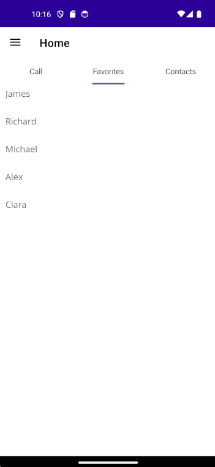
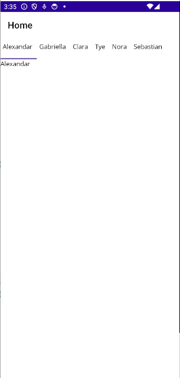

# Getting Started with .NET MAUI TabView (SfTabView)

This section provides a quick overview for working with the SfTabView for .NET MAUI. Walk through the entire process of creating a real world of this control.

## Creating an application using the .NET MAUI Tab View
 1. Create a new .NET MAUI application in Visual Studio.
 2. Syncfusion .NET MAUI components are available on [nuget.org](https://www.nuget.org/). To add SfTabView to your project, open the NuGet package manager in Visual Studio, search for Syncfusion.Maui.TabView and then install it.

## Register the handler

To use this control inside an application, you must register the handler for Syncfusion® core.

```C#

using Microsoft.Extensions.Logging;
using Syncfusion.Maui.Core.Hosting;

namespace TabViewGettingStarted
{
    public static class MauiProgram
    {
        public static MauiApp CreateMauiApp()
        {
            var builder = MauiApp.CreateBuilder();
            builder
                .UseMauiApp<App>()
                .ConfigureSyncfusionCore()
                .ConfigureFonts(fonts =>
                {
                    fonts.AddFont("OpenSans-Regular.ttf", "OpenSansRegular");
                    fonts.AddFont("OpenSans-Semibold.ttf", "OpenSansSemibold");
                });

#if DEBUG
    		builder.Logging.AddDebug();
#endif

            return builder.Build();
        }
    }
}

```

## Add a basic Tab View
1. Import the control namespace `Syncfusion.Maui.TabView` in XAML or C# code.
2. Initialize [SfTabView](https://help.syncfusion.com/cr/maui/Syncfusion.Maui.TabView.SfTabView.html) control.

**XAML**
```
<ContentPage 
            ...
            xmlns:tabView="clr-namespace:Syncfusion.Maui.TabView;assembly=Syncfusion.Maui.TabView">
    <ContentPage.Content> 
        <tabView:SfTabView /> 
    </ContentPage.Content>  
</ContentPage>
```

**C#**
```
using Syncfusion.Maui.TabView;
namespace TabViewGettingStarted
{
    public partial class MainPage : ContentPage
    {
        public MainPage()
        {
            InitializeComponent();           
            SfTabView tabView = new SfTabView();   
            this.Content = tabView; 
        }
    }   
}

```

## Populate tab items in .NET MAUI Tab View

Tab items can be added to the control using the [Items](https://help.syncfusion.com/cr/maui/Syncfusion.Maui.TabView.SfTabView.html#Syncfusion_Maui_TabView_SfTabView_Items) property of [SfTabView](https://help.syncfusion.com/cr/maui/Syncfusion.Maui.TabView.SfTabView.html).

**XAML**

```
<?xml version="1.0" encoding="utf-8" ?>
<ContentPage 
. . .
             xmlns:tabView="clr-namespace:Syncfusion.Maui.TabView;assembly=Syncfusion.Maui.TabView">

    <tabView:SfTabView x:Name="tabView">
        <tabView:SfTabView.Items>
            <tabView:SfTabItem Header="Call">
                <tabView:SfTabItem.Content>
                    <Grid BackgroundColor="Red" />
                </tabView:SfTabItem.Content>
            </tabView:SfTabItem>

            <tabView:SfTabItem Header="Favorites">
                <tabView:SfTabItem.Content>
                    <CollectionView>
                        <CollectionView.ItemsSource>
                            <x:Array Type="{x:Type x:String}">
                                <x:String>James</x:String>
                                <x:String>Richard</x:String>
                                <x:String>Michael</x:String>
                                <x:String>Alex</x:String>
                                <x:String>Clara</x:String>
                            </x:Array>
                        </CollectionView.ItemsSource>
                        <CollectionView.ItemTemplate>
                            <DataTemplate>
                                    <Grid Margin="10,5" HeightRequest="40">
                                        <Label
                                            VerticalOptions="Start"
                                            HorizontalOptions="Start"
                                            TextColor="#666666"
                                            FontSize="16"
                                            Text="{Binding}"/>
                                    </Grid>
                            </DataTemplate>
                        </CollectionView.ItemTemplate>
                    </CollectionView>
                </tabView:SfTabItem.Content>
            </tabView:SfTabItem>

            <tabView:SfTabItem Header="Contacts">
                <tabView:SfTabItem.Content>
                    <Grid BackgroundColor="Blue"/>
                </tabView:SfTabItem.Content>
            </tabView:SfTabItem>
        </tabView:SfTabView.Items>
    </tabView:SfTabView>

</ContentPage>

```

**C#**

```

using Syncfusion.Maui.TabView;

namespace TabViewGettingStarted
{
    public partial class TabView : ContentPage
    {
        public TabView ()
        {
            InitializeComponent ();
            var tabView = new SfTabView();

            // First tab: Call
            var callTab = new SfTabItem { Header = "Call" };
            callTab.Content = new Grid
            {
                BackgroundColor = Colors.Red
            };
            tabView.Items.Add(callTab);

            // Second tab: Favorites
            var favoritesTab = new SfTabItem { Header = "Favorites" };
            var collectionView = new CollectionView();

            // Items source
            var itemsSource = new string[] { "James", "Richard", "Michael", "Alex", "Clara" };
            collectionView.ItemsSource = itemsSource;

            // Item template
            collectionView.ItemTemplate = new DataTemplate(() =>
            {
                var grid = new Grid
                {
                    Margin = new Thickness(10, 5),
                    HeightRequest = 40
                };
                var label = new Label
                {
                    VerticalOptions = LayoutOptions.Start,
                    HorizontalOptions = LayoutOptions.Start,
                    TextColor = Color.FromArgb("#666666"),
                    FontSize = 16
                };
                label.SetBinding(Label.TextProperty, ".");
                grid.Children.Add(label);
                return grid;
            });

            favoritesTab.Content = collectionView;
            tabView.Items.Add(favoritesTab);

            // Third tab: Contacts
            var contactsTab = new SfTabItem { Header = "Contacts" };
            contactsTab.Content = new Grid
            {
                BackgroundColor = Colors.Blue
            };
            tabView.Items.Add(contactsTab);

            this.Content = tabView;
        }
    }
}

```

Run the application to render the following output:



## Populate ItemsSource

Items can be added to the control using the [ItemsSource](https://help.syncfusion.com/cr/maui/Syncfusion.Maui.TabView.SfTabView.html#Syncfusion_Maui_TabView_SfTabView_ItemsSource) property of [SfTabView](https://help.syncfusion.com/cr/maui/Syncfusion.Maui.TabView.SfTabView.html).

Objects of any class can be provided as items for `SfTabView` using `ItemsSource`. The views corresponding to the objects can be set using the [HeaderItemTemplate](https://help.syncfusion.com/cr/maui/Syncfusion.Maui.TabView.SfTabView.html#Syncfusion_Maui_TabView_SfTabView_HeaderItemTemplate) for the header items and [ContentItemTemplate](https://help.syncfusion.com/cr/maui/Syncfusion.Maui.TabView.SfTabView.html#Syncfusion_Maui_TabView_SfTabView_ContentItemTemplate) for the content.

Create a **Model** class using the TabItems collection property, initialized with the required number of data objects, as shown in the following code examples.

**Model**

```
public class Model: INotifyPropertyChanged
{

    public event PropertyChangedEventHandler PropertyChanged;

    protected void OnPropertyChanged(string propertyName)
    {
        var handler = PropertyChanged;
        if (handler != null)
            handler(this, new PropertyChangedEventArgs(propertyName));
    }

    private string name;

    public string Name
    {
        get { return name; }
        set
        {
            name = value;
            OnPropertyChanged("Name");
        }
    }
}

```

**TabItemsSourceViewModel**

```
public class TabItemsSourceViewModel:INotifyPropertyChanged
{
    public event PropertyChangedEventHandler PropertyChanged;

    protected void OnPropertyChanged(string propertyName)
    {
        var handler = PropertyChanged;
        if (handler != null)
            handler(this, new PropertyChangedEventArgs(propertyName));
    }

    private ObservableCollection<Model> tabItems;
    public ObservableCollection<Model> TabItems
    {
        get { return tabItems; }
        set
        {
            tabItems = value;
            OnPropertyChanged("TabItems");
        }
    }
    public TabItemsSourceViewModel()
    {
        TabItems = new ObservableCollection<Model>();
        TabItems.Add(new Model() { Name = "Alexandar" });
        TabItems.Add(new Model() { Name = "Gabriella" });
        TabItems.Add(new Model() { Name = "Clara"});
        TabItems.Add(new Model() { Name = "Tye" });
        TabItems.Add(new Model() { Name = "Nora" });
        TabItems.Add(new Model() { Name = "Sebastian" });
        
    }

}
```

**XAML**
```

    <tabView:SfTabView ItemsSource="{Binding TabItems}" >
        <tabView:SfTabView.HeaderItemTemplate>
                <DataTemplate >
                    <Label  Padding="5,10,10,10"  Text="{Binding Name}"/>
                 </DataTemplate>
            </tabView:SfTabView.HeaderItemTemplate>
             <tabView:SfTabView.ContentItemTemplate>
                <DataTemplate>
                     <Label TextColor="Black"  Text="{Binding Name}" />
               </DataTemplate>
        </tabView:SfTabView.ContentItemTemplate>
    </tabView:SfTabView>
    
```

**C#**
```
namespace TabViewItemTemplateSample;

public partial class MainPage : ContentPage
{

    TabItemsSourceViewModel model;
    SfTabView tabView;
    public MainPage()
    {
        InitializeComponent();
        model = new TabItemsSourceViewModel();
        this.BindingContext = model;
        tabView = new SfTabView();
        tabView.ItemsSource = model.TabItems;
        tabView.HeaderItemTemplate = new DataTemplate(() =>
        {
            var nameLabel = new Label { Padding = new Thickness(5,10,10,10)};
            nameLabel.SetBinding(Label.TextProperty, "Name");
            
            return nameLabel;
        });
        tabView.ContentItemTemplate = new DataTemplate(() =>
        {
            var nameLabel = new Label { TextColor=Colors.Black };
            nameLabel.SetBinding(Label.TextProperty, "Name");
            return nameLabel;
        });
        this.Content = tabView;
    }
}

```

Run the application to render the following output:

